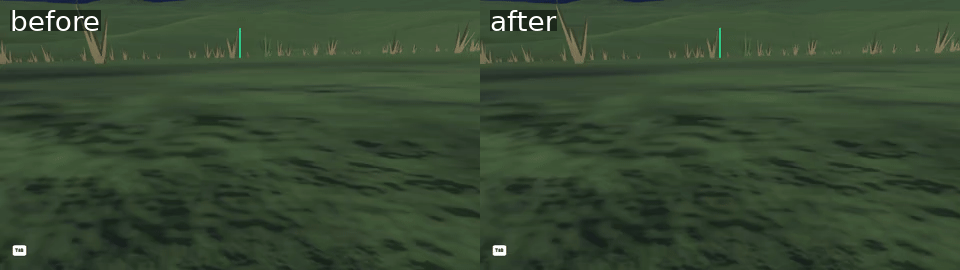
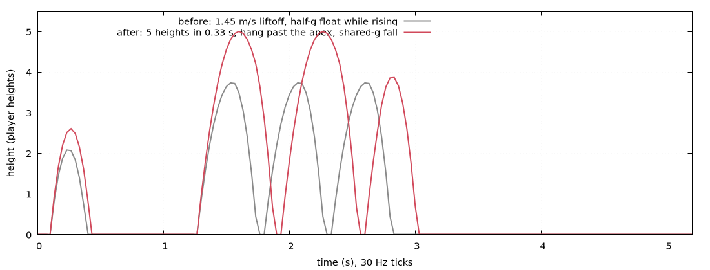

# rl#367 round 2 — jump feel: height + time-to-apex, coyote time, jump buffer, apex hang

Verdict on round 1 (liftoff 1.45 m/s, half-gravity float): "better, but not awesome".
Round 2 restates the jump the way the platformer canon does — an apex height and a
time-to-apex, with liftoff speed and rise gravity derived — and adds the input
forgiveness the canon says matters most: coyote time, jump buffering, variable height
on release, a hang at the top, and a fall about twice as fast as the rise.

Same scripted input on both sides (`capture.sh`): seed 7, on foot, camera pitched 25°
down, a 2-frame JUMP tap at frame 95, JUMP held over frames 130–175 (auto-hop re-fires
on each touchdown; the hold ends mid-rise of the third hop). Captured headless at tick
rate, played at 12 fps. `arcs.png` is the per-tick altitude out of the same runs
(`RL_POS_TRACE`, `plot.gp`).

Measured off the traces (player heights, 30 Hz ticks):

| hop                  | before                     | after                       |
|----------------------|----------------------------|-----------------------------|
| tap                  | 2.08 high, apex +4, 0.30 s | 2.61 high, apex +5, 0.33 s  |
| full hold            | 3.74 high, apex +8, 0.50 s | 5.00 high, apex +10, 0.63 s |
| hold released mid-rise | —                        | 3.87 high, apex +7, 0.43 s  |

Constants (`net-proto/src/sim.rs`): `JUMP_HEIGHT` = 5 player heights,
`JUMP_APEX_TICKS` = 10 (0.33 s); derived `JUMP_RISE_GRAVITY` = 2h/t² (4.6 m/s²),
`JUMP_SPEED` = 2h/t + g/2 (1.6 m/s); `JUMP_HANG_SPEED` = `JUMP_SPEED`/4;
`COYOTE_TICKS` = 4 (0.13 s); `JUMP_BUFFER_TICKS` = 4 (0.13 s). The fall is the one
shared 9.81 m/s² every craft falls under — plane-exit ballistics unchanged.

Coyote time and the buffer are windows, not arcs, so they show in the tests rather than
the strip: `coyote_time_lifts_off_after_the_ground_falls_away` (a skid off a terrain
drop, JUMP on the last window tick lifts off, one tick later does not) and
`buffered_jump_fires_on_landing` (every press tick of a tap arc scanned: fires on the
first grounded tick iff within 4 ticks of touchdown).

Repro: `capture.sh <game-binary> <out-dir>` for each build, then
`gnuplot -c plot.gp before/trace.csv after/trace.csv arcs.png`.
