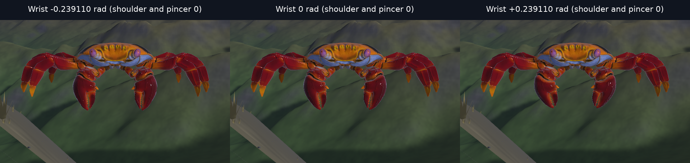

# Bilateral claw wrist kinematics

The left wrist now uses `(0.86062, +0.27404, -0.42922)`, the axial reflection
`det(S) S a` of the right wrist for `S = diag(-1, 1, 1)`. The generator emits this
axis; the regenerated baked table is the runtime input.

`claw_joint_frames_and_point_trajectories_are_bilateral` prescribes the low,
zero, and high coordinate of every claw joint: 27 shoulder/wrist/pincer
combinations, with equal bilateral coordinates. It checks all three joint
frames and attached-point trajectories in carapace coordinates. Position and
point errors must remain below 1 mm; quaternion distance (allowing either sign)
must remain below 0.001. This checks kinematics, not equal dynamics or a
locomotion benefit; left/right masses and collider fits still differ.

The screenshot pose mode now takes radians and prescribes forward kinematics
through `CrabRenderPose`, with unselected joints at zero. It does not modify
physics poses. Its camera follows that rendered root. The tests
`prescribed_wrists_render_equal_coordinates_without_moving_physics` and
`screenshot_camera_follows_rendered_root` cover those seams.

Changing the table changes the body digest from `33628dfeaeb29dd3` to
`e0ee5cb3004246ce`. A warm policy trained on the old table is not comparable
after this change: its learned actions target a different plant. Treat this as
an MDP change when evaluating or retraining ([rl#31](https://github.com/bddap/rl/issues/31)).

## Matched-pose sweep



Left to right: both wrists at −0.239110, 0, and +0.239110 radians: the wrist
limits and zero. Both shoulders and pincers remain at zero. Each panel is a crop of the same frontal view, rendered
with Vulkan lavapipe (`llvmpipe`, LLVM 21.1.8, Mesa 26.1.5). No policy checkpoint
is loaded. The panels show the prescribed kinematics over the existing Sally
skin, whose geometry need not be exactly symmetric.

Reproduction, from the repository root after building `rl-demo`:

```sh
nix-shell shell.nix --run 'cargo build --release -p rl-demo -p game -p rl-update-ui'
export VK_ICD_FILENAMES=/run/opengl-driver/share/vulkan/icd.d/lvp_icd.x86_64.json
export WGPU_BACKEND=vulkan
for angle in -0.239110 0 0.239110; do
  nix-shell shell.nix --run "\"\$CARGO_TARGET_DIR/release/rl-demo\" screenshot wrist-$angle.png \
    --terrain --checkpoint-dir no-ckpt --rig-pose-part wrist --rig-pose $angle \
    --shot-cam 0,5.7,3.5 --shot-focus 0,5.05,0.2 --width 960 --height 720 \
    --settle 110 --moon-timescale 0"
done
```

The proof crops each 960×720 capture to `(x=160, y=200, width=640, height=400)`,
adds a 56-pixel caption strip, and stacks the panels horizontally. Cropping
omits the policy-status label and keeps the full claw motion visible.

## Mutation check

Copying the right wrist axis back onto the left in the generator and regenerating
the table makes `claw_joint_frames_and_point_trajectories_are_bilateral` fail
(exit 101). At shoulder −0.350, wrist −0.239110, pincer −0.500, the left wrist
has quaternion distance 0.1215 and point-trajectory error 0.0144 m.
Restoring the reflected generator and baked table makes the same regression pass
again (exit 0, one test passed). The mutation is confined to a scratch worktree.
