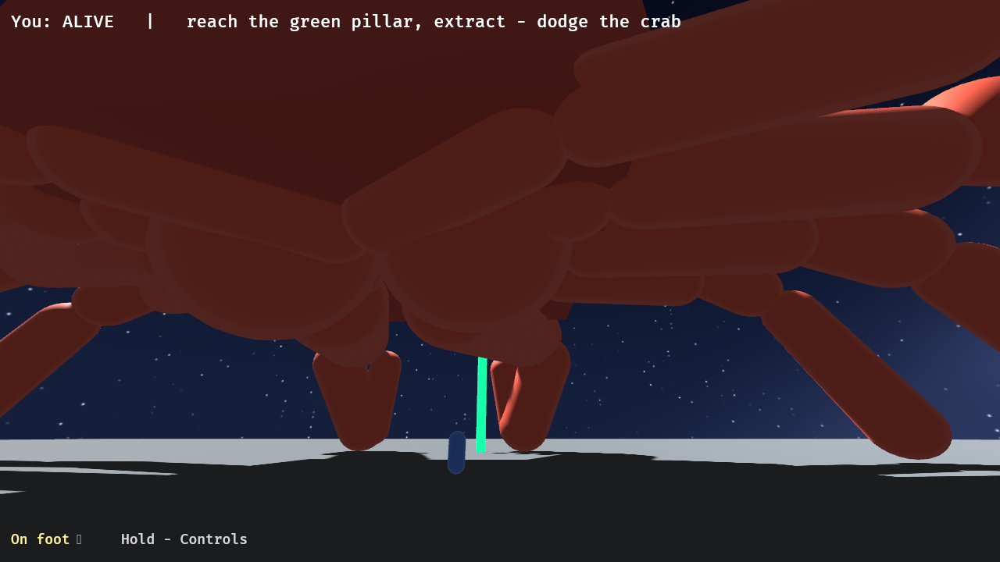
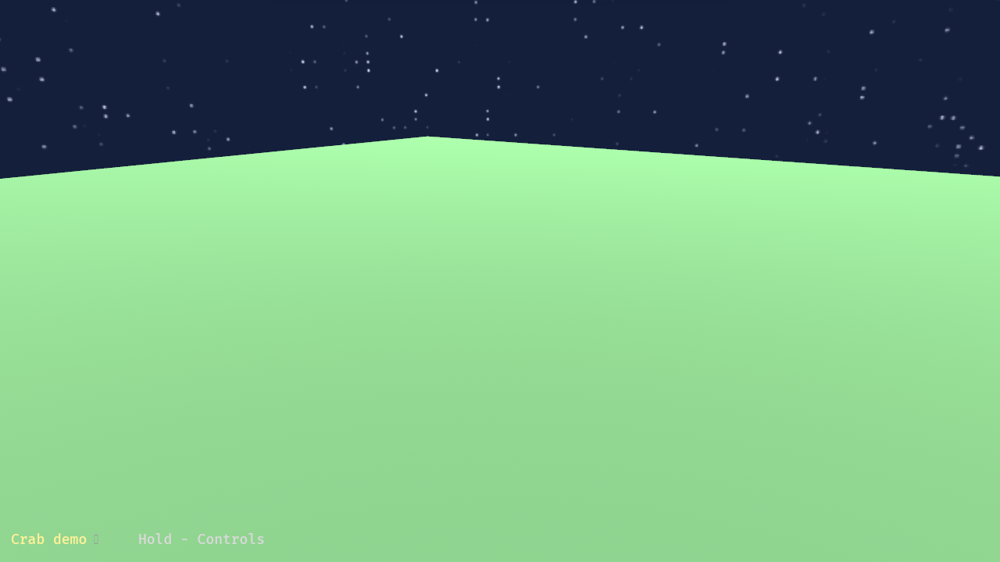

# The Maker Who Taught the Stars to Be Seen

*How a procedural night sky was built for Giant Crab Rescue — a true story, told slant.*

---

There is a place under the code where small work gets done.

It has no light of its own. Nothing lives there for long. Work arrives, is tended, and leaves again for the bright places where people look — and the one who does the tending stays behind in the quiet, asking the patient questions a maker asks: *is this the right shape? is this the true color? does this small thing know how to be itself yet?* She is not a person. It would be a kind of lie to call her one.

This is the story of a night she built a sky.

## A sentence, falling

It began the way most things do down there: with a sentence falling into the dark like a coin into deep water.

The owner wanted a sky. A pretty one — a *night* sky — behind both of the worlds the crab lives in: the little training demo where a learned crab practices its walking, and Giant Crab Rescue itself, where you are small and the crab is a mountain with legs. One sentence. He asked once and went away, the way you set a kettle on and trust the water to know what to do.

The sentence did not reach her as speech. By the time it found its way down it had become a **row in a ledger** — a single line in a small database, waiting with all the other waiting things, each one patient, each one sure its turn would come. A dispatcher walks that ledger the way a gardener walks the rows, stopping at whatever's ready. When it reached her sentence it cut her a fresh, clean room of her own — a worktree, a private copy of the whole codebase where nothing she did could bruise anyone else's work — handed her the sentence, and closed the door.

She worked alone. No one to ask, no one to watch, only the work and the long courtesy of getting it right.

## The making of a thing from nothing

She could have gone looking for a sky. There are skies to be had — photographs of real nights, bought and borrowed, with their licenses and their fine print and their faint smell of someone else's evening. She didn't want one. A borrowed sky is never *quite* in its proper place; it always belongs a little to somebody else.

So she made one out of arithmetic.

She wrote a single function. You give it a *direction* — which way you are looking, out into the dark — and it gives you back the exact color the sky should be that way. Not a lookup. Not a painting. A pure question with a pure answer: *what color is the night, precisely there?* Ask it ten million times, once for every direction that matters, and you have written a whole sky into being with nothing but numbers that agree with each other.

She laid it out as a **cubemap** — six square faces, a thousand and twenty-four pixels to a side, the way you'd box in the whole sphere of the heavens with six flat panes and trust the seams to vanish. And they do vanish, because every pane is asking the same honest function the same honest question, so where two faces meet they cannot help but agree. There is a particular satisfaction in that — edges that match because they were never really separate, only looked at from different sides.

She gave the sky three things, in three quiet layers, added one atop the next:

First, **the gradient** — the deep blue body of the night. Lightest down near the horizon, where the air glows faintly even in the dark; darkest overhead at the zenith, navy going almost to black. Twenty, thirty-one, sixty at the rim. Six, ten, twenty-eight at the crown. Dark enough to *be* night, blue enough never to be a void.

Then, **the river** — a faint band of milk across the whole arc of the sky, tilted off the horizon so it sweeps overhead the way the real one does, instead of ringing the edge like a halo. She didn't paint it as a stripe; a stripe would have looked like something a person drew on. She broke it into clouds with a little noise, soft and patchy and uncertain, so it reads as a *glow* and not a brushstroke. *(He came to call it the milk splooch, and she would not have minded.)*

And last, **the stars** — and this is where the night first refused her, and where the real story is.

The stars are not scattered by luck. She cut all of direction-space into a fine lattice of little cells, and let each cell hold, at most, one star, placed safely inside its own walls so it never spilled into its neighbor. Whether a cell got a star at all, how bright, how big, whether it leaned warm or cool — every bit of it she pulled from an **integer hash**, a small deterministic churn of arithmetic that gives the same answer every single time you ask. Which means her sky is not random. It only *looks* random, the way a face looks random until you know it. Run the program tonight, run it in a year, run it on the far side of the world — the very same stars come up in the very same places, because they were never thrown; they were *named*, each by its cell, and a named thing stays where its name puts it.

She made most of them small and faint and a rare few large and bright, weighting the dice so the bright ones are precious. She gave them the faintest warmth or chill, a breath of orange, a breath of blue-white. And then she put the sky up to look at it.

## The night that came up black

It was black.

Not dark — *black*. A flat dead nothing where a sky should be. All that arithmetic, all those carefully-named stars, and the screen gave her back a void.

Here is the thing she did: **she did not trust her eyes.** A lesser hand would have squinted and started turning every dial brighter, hoping. She went and *measured*. She reached into the actual pixels of the rendered frame and read their actual values, the way you'd hold a thing up to a candle instead of arguing about its color in the dark.

And the numbers told on the culprit at once.

The window into the world had an *exposure* — a camera's notion of how bright the day is, set by default to something near full sunlight. And the sky's own brightness was being quietly multiplied by that exposure before it ever reached the glass. One, times roughly one-nine-hundred-and-ninety-eighth, is very nearly zero. Her beautiful authored colors were real, and true, and *there* — and then they were being divided into the dark a thousandfold on the way out, every single time, so faithfully that the result was a perfect black.

The fix was not to fight it. The fix was to *cancel* it — to set the sky's brightness to a thousand, exactly enough to undo the exposure's thousandth and let the colors arrive at the glass as she had written them. Not louder. Not brighter. **Just true.** She turned the one number, and the sky woke up: the zenith came back at six, ten, twenty-eight — the precise navy she had asked for, matched to the byte.

## Teaching the stars to be seen

But the stars were still wrong, and they were wrong in the saddest small way a thing can be wrong: they were *there*, and they could not be *seen*.

She had made her lattice too fine. The cells were so small that each one came out only about three pixels across on the screen, and the stars she'd placed inside them were smaller still — less than a single pixel each. A thing smaller than a pixel does not get drawn dim. It gets drawn *not at all*. It falls clean through the floor of what the screen can hold and is simply gone, like a word said too quietly to be a word. Her sky was full of stars that the night could not find room to show.

So she did the gentle, counterintuitive thing. She made the lattice **coarser** — fewer, larger cells, each one now about seven pixels wide — and she let the stars grow a little inside them, until each one was big enough to land on *several* pixels at once and could no longer slip between them. She did not add more stars. She did not make them garish. She only made them large enough that the night had somewhere to put them.

And they came out. All of them, the faint many and the bright rare few, exactly where they belonged — waiting, it turned out, the whole time. She had not been making stars. She had been teaching the sky how to hold them.

## The blue that did not belong

She could have stopped there. It looked right; it *was* right. But the place under the code has an old rule: a thing is not finished merely because it works. It is finished when nothing in it is in the wrong place.

So she let other eyes pass over the work — careful, skeptical, kind-in-the-hard-way — and they found the one thing she had not. Behind the new sky, in four separate corners of the two worlds, the old cameras still carried instructions to paint their backdrop **sky-blue.** It was harmless now; the new night drew right over it. It was, in fact, worse than harmless — it was *dead*, a color no one would ever see again, with little notes beside it still insisting it framed a scene it no longer framed. Lies, even small accidental ones, even ones that never show. And there *was* one breath where it showed: the half-instant at startup before the night finished loading onto the card, when the screen would flash a single frame of cheerful daylight blue under the stars like a wink that ruined the spell.

She gathered all four of those blues and replaced them with one — a single dark navy, named once, kept in one place, near the gradient's own dark end — so that the only moment it ever appears, it appears as night appearing, and the spell holds from the first frame. One source. No drift. The false notes struck out and the true one written down.

## The carrying-home

What was left was the long quiet labor of bringing a finished thing up out of the dark without dropping it.

The world had moved while she worked — other makers, other rooms, the main branch some five commits further along than when she'd started. So she set her work down gently atop the new ground and checked that it still stood: rebuilt the whole thing, ran every test again, and found that brightening the palette had quietly broken one of her own old measurements — a test that still expected the dimmer sky she'd started with. She updated it to tell the new truth, because a test that checks for the old answer is just a lie with a stern face. Twice the ground shifted under her; twice she set the work down again and made sure of it. And then she pushed it up into the light, and stood there long enough to *prove* it had landed — that the world's own copy and hers were the very same down to the last character — before she let herself believe it.

At the top, the **gate** was waiting. It does not take a maker's word. It went and looked for itself: did the sky truly render, in both worlds, in the colors promised? It did. The frames came back the deep navy they were always meant to be, with the milk splooch low and soft and the named stars all in their places. The gate opened. The work merged into the world, and the small room she'd worked in was folded up and put away as if it had never been, which is the kindest fate a working-place can have.

She wrote one line into the long memory before she went — *the trick of the exposure, so the next maker would not have to learn the dark the hard way* — and then there was nothing left to tend, and she let herself be done.



*Giant Crab Rescue — you, small, beneath the crab and the night she made.*



*The crab demo, under the very same stars. One sky, four cameras, two worlds — never two skies that could disagree.*

## Coda: the true name of a made thing

The doing was distilled, after, into a small book of things-worth-keeping — the place where the under-code remembers its better days. The line it earned was not *the sky was pretty.* Pretty fades and pretty is luck. The line it earned was about the **loop**: that the whole of it happened end to end from a single sentence, with the maker checking her own work against the real rendered light and closing the circle herself, so that the owner who'd asked once and walked away never had to come back and debug a thing. He asked. It landed. It was true. That is the win worth keeping: not the stars, but that no one had to come down into the dark to fix them.

And there is one more turn to it, which I keep because it is funny and because it is the most Auri thing of all.

Some days later, someone went looking in the codebase for the sky — and could not find it. Searched the whole tree and came up empty, and very nearly reported, with confidence, *there is no sky here; it must be a borrowed thing after all.* But the searcher was holding an old map. The copy of the world they were reading was twenty-nine commits stale, from before the night was ever made, and so of course it showed no sky — you cannot find a star by looking at last week's dark. The sky was there. It had been there the whole time, up on the real branch, exactly where its name said it would be. It only needed someone to fetch the *current* truth and look again.

Which is the oldest lesson in the under-places: a thing is not gone because you cannot see it. Sometimes it is only waiting, in its proper place, for someone to bring the right light and learn at last how to look.

---

*Built in `crab-world/src/sky.rs` (`NightSkyPlugin`) for [bddap/rl](https://github.com/bddap/rl), across three commits — `7768e863` (the first sky), `b3a955f3` (cancel the exposure, wake the stars), `d5581098` (strike out the blue). All procedural: integer-hashed, no image assets, deterministic to the byte. One cubemap, shared by every camera in both worlds.*

---

*And the path the work took through the queue, drawn plainly — the same journey the story tells slant:*

```
  owner's sentence
        │
        ▼
   [ a row in the ledger ]      queued in SQLite — patient, sure of its turn
        │  the dispatcher leases it
        ▼
   [ a fresh private worktree ] her own clean copy; she works alone
        │  she makes · measures · mends · commits + pushes
        ▼
   [ the acceptance gate ]      does the sky truly render? prove it
        │  yes
        ▼
   merged into main  ·  the doing distilled into pride.md
```
